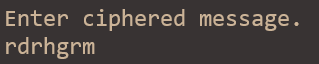
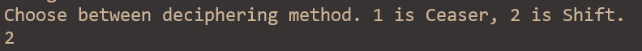
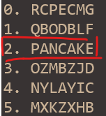

# Fertiges Projekt
Mein Nebenprojekt dieser Lernperiode war ein erweitertes Caeser-Entschlüsselung Program. Mit C#.
 
Man gibt eine verschlüsselte Nachricht rein.
 
 
Wählt eine der Methoden.  
 
 
Zurück bekommt man 26 mögliche Lösungen. 
Sehr simpel 
Das Programm nimmt eine Nachricht mit entweder lowercase oder UPPERCASE. Dann wird die Nachricht in UPPERCASE ausgegeben. Andere zeichnen als in Lateinalphabet werden ignoriert und zu entschlüsselte Nachricht addiert. (rdrhgrm?! wird zu PANCAKES?!)

# Grobplanung

# 23/08

- [x] Mir zusammenfassen, was die Eigenschaften und Feldern bei OOP bedeuten

- [x] Zugriffsmodifizierung verstehen und...

- [ ] dazu Auftrag 4213 Lösen

- [ ] Konstruktoren & init Objekte verstehen und dazu Auftrag lösen

- [ ] Falls Zeit übrig ist, Shift Chiffre Programm fertigen, indem dort ein Wert nicht mehr unten null gehen kann.

Heute habe ich den Unterschied zwischen Eigenschaften und Feldern verstanden. Das ist weil ich zwei Videos angeschaut habe. Nun konnte ich mir das notieren. Ich habe danach zu Auftrag gewächselt. Der Auftrag ist nicht wirklich kompliziert, eher das übersetzen der Ideen in Eigenschaften und Methoden. Ich weiss noch nicht, wie Methode funktionier und deswegen ist es schlecht gegangen. (58)

## 30/08

- [x] Methodenüberladung 4207

- [x] Erstelle 10 Fragen für Checkliste und überprüfe kanti baden Webseite

- [x] Falls Zeit übrig ist, Shift Chiffre Programm fertigen, indem dort ein Wert nicht mehr unten null gehen kann.

Heute habe ich am Anfang an zwei Aufträge gearbeitet. Da ich seit letztes Lernperiode gelernt habe, wie Methoden funktionieren, konnte ich den Auftrag leicht lösen. Danach habe ich das Auftrag über Accessibility mit Robin aufgeteilt, sodass wir schneller den Auftrag erfüllen. Gegen ende habe ich eine Idee für den Schifr entworfen. Es hat tatsächlich funktioniert, und nun funktioniert der erste Teil des Shift Ziffer, also ein Cesär Ziffer. Die Arbeit war nicht so schwierig heute, habe aber auch leicht gearbeitet. (80)

## 06/08

- [x] Test zu 1715 zu Authentisierung Authentifizierung Autorisierung lösen
- [ ] Shift Chiffre fertigstellen, indem nun der Schlüssel um eins nach jede Buchstabeübersetzung verschoben wird
- [x] Auftrag 1712 über Zugriffsschutz
- [x] Auftrag 1718 Gefährdung

Heute habe ich eher gut gearbeitet. Ich habe zuerst das Thema AAA wiederangeschaut, wiederverstand und konnte den Test lösen. Danach aber habe ich zu viel Zeit gebracht, um verschiedene technische Möglichkeiten auf Zugriffschutz anzuschauen. Der Test habe ich ohne Probleme gelöst, und noch am Ende zur Ähnliche Thema habe ich Gefährdung angeschaut und direkt Test gelöst. Noch kurz vor Ende habe ich wieder Chiffre-Code angeschaut und habe Tipps bekommen, wie ich diesen verbessern kann. (74)

## 13/08

- [x] Funktionen analysieren, was sie wirklich tun und mit einfacheren Methoden ersetzen ( alphabet[] alphabet.IndexOf('a') )
- [x] Cesaer Chiffre in eigene Funktion verschieben mit Parametern (string Message, int shift)
- [x] Versuche dann in Shift Chiffre um zu wandeln, indem es um das shift und um i verschoben wird
- [x] Frage Benutzer nach Verschlüsselten Nachricht und Verschiebung (Optional) und gebe die entschlüsselte Nachricht 

Heute bin ich sehr mit meine Arbeit zufrieden. Ich habe zuerst die Funktionen erstetzt. Das ging leicht, sie waren schon in die C# Sprache eingebaut und sie hatten gleiche Paramater, wie ich geschrieben habe. Dann habe ich Ceaser Chiffre in eigene Funktion verschoben. Ich kopierte die Funktion und umbaute sie als Shift Funktion. Das hat am meisten Zeit gebraucht. Ich habe oft Pausen gemacht und die Schrittweise dargestellt. Danach mit Ausprobierungen habe ich es verstanden und die Nachricht entschlüsselt. Am Ende habe ich Eingaben von Benutzer ermöglicht. (87)

## 20/08

- [x] zwei Szenarien für Ignazio erstellen
- [x] sechs User Stories erstellen
- [x] Low-Fidelity anfangen (Informationsstruktur mit Bilder und Text, Landing Page, Prozess)
- [x] in Tabelle 1 Artefakten Eintragen und Lernjournal erfüllen
Heute bin ich mit meinem Leistung sehr zufrieden. Zusammen mit Tim haben wir an die LB gearbeitet. Erstens haben wir je eine Szenarie für unsere Persona erstellt. Somit ist es schnell erstellt. Aber dann mussten wir User Stories erfinden, was uns Schwierigkeiten gebracht hat. Dafür haben wir gute Anschaung von Persona und Szenarien gebraucht. Noch bis Ende haben wir noch geschafft, einfache Skizze unsere Webseite zu zeichnen. Dann haben wir unsere Arbeit dokumentiert. (73)

## 27/08 OPL

- [x] ~Bei Entschlüsselung Programm den Benutzer ermöglichen, Shift einzugeben. Gerade wird die Eingabe ignoriert.~

- [x] Überprüfen, ob das Programm wirklich funktioniert, da ein Shift Schlüssel irgendwie durch Ceaser Decipher Methode entschlüsselt wurde.
